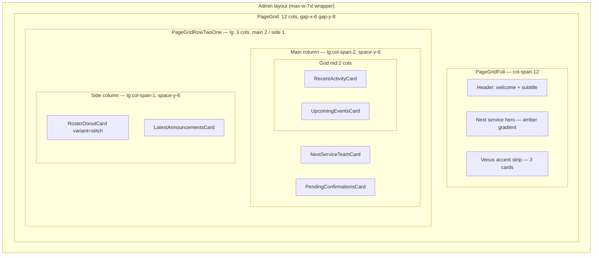

# Admin dashboard page — layout dossier

**Route:** `/admin`  
**Implementation:** `apps/web/app/(admin)/admin/page.tsx`  
**Chrome wrapper:** `apps/web/app/(admin)/layout.tsx` (max-width + padding inside `AdminShell`)  
**Companion file:** [dashboard-page-layout.html](./dashboard-page-layout.html) — static HTML mirror of the DOM order and major regions (open in a browser; uses Tailwind CDN for rough parity).

---

## Purpose

This dossier exists to **reorganize the dashboard layout** without spelunking the React tree. It documents:

1. **Visual hierarchy** (top → bottom, full-width vs two-column).
2. **Data ownership** (what each block needs from Supabase / state).
3. **A portable HTML skeleton** you can duplicate into Stitch, Figma HTML import, or a wireframe tool.

Constraints from product direction (do not regress without intent):

- **No glow** on migrated UI (neutral shadows only).
- **Surfaces** use design tokens (`--bg`, `--surface`, `--surface-2`, `--text-*`, `--border`, etc.), not one-off Stitch cream hexes.

---

## Layout model



---

## Region map

| # | Region | Component | Primary data |
|---|--------|-----------|--------------|
| 1 | Welcome header | Inline in page | `displayName` |
| 2 | Next service hero | Inline in page | `thisWeekStrip.nextServiceLabel`, `nextPlan`, `nextServiceAt`, `churchAddress`, open/pending counts, `planHref` |
| 3 | Accent strip | `VenusAccentStrip` | Static links + images |
| 4 | Next service team | `NextServiceTeamCard` | `teamRows`, `nextServiceDateLabel` |
| 5 | Pending responses | `PendingConfirmationsCard` (default) | `pendingRows` |
| 6 | Recent activity | `RecentActivityCard` | `recentActivity[]` |
| 7 | Upcoming events | `UpcomingEventsCard` (default) | `eventPreviews` |
| 8 | Roster mix donut | `RosterDonutCard` `variant="stitch"` | `rosterMix` |
| 9 | Latest announcements | `LatestAnnouncementsCard` (default) | `announcementPreviews` (optional `excerpt`) |

`thisWeekStrip` is still populated for hero copy and counts; the **`ThisWeekStrip` React component** is not mounted on this page (metrics are inlined in the hero only).

---

## Grid CSS (reference)

From `apps/web/components/layout/PageGrid.tsx`:

- **PageGrid:** `grid w-full grid-cols-12 gap-x-6 gap-y-8` (+ page passes `gap-y-4 md:gap-y-5`).
- **PageGridFull:** `col-span-12 min-w-0`.
- **PageGridRowTwoOne:** outer `col-span-12 grid grid-cols-1 gap-6 lg:grid-cols-3 lg:items-start`; main `lg:col-span-2 min-w-0 space-y-6`; side `lg:col-span-1 min-w-0 space-y-6`.
- **PageGridRowThirds** (inside Venus strip): `col-span-12 grid grid-cols-1 gap-6 md:grid-cols-3 lg:items-start`.

---

## Reorganization notes (prompts)

- **Hero vs team:** The gradient hero summarizes the *next service*; `NextServiceTeamCard` repeats roster detail — consider collapsing or cross-linking.
- **Venus strip:** Full-width third row; easy to move above hero or below two-column row depending on priority.
- **Side column:** Donut + announcements stack; if announcements need width, swap with a main-column slot or use tabs.
- **Pending + activity:** Both are “attention” surfaces; pairing with events in a 2×2 bento is an alternative to the current `md:grid-cols-2` pair.

---

## Static HTML

The full **layout mirror** (placeholders, same nesting as production) lives in:

**[dashboard-page-layout.html](./dashboard-page-layout.html)**

Below is the same structure in a single fenced block for quick copy (no Tailwind CDN here — use the `.html` file for a visual pass).

```html
<!-- Simplified: production uses Next.js + Tailwind classes on each node. -->
<div class="page-grid">
  <div class="page-grid-full">
    <header>
      <h1>Welcome back, {{displayName}}</h1>
      <p>Weekly operations overview</p>
    </header>
    <section aria-labelledby="next-service-heading">
      <div class="next-service-hero"><!-- amber-aura-gradient -->
        <div class="hero-inner">
          <div class="hero-copy">
            <div class="eyebrow">Next service</div>
            <div id="next-service-heading" class="title">{{thisWeekStrip.nextServiceLabel}}</div>
            <p class="plan-title">{{nextPlan.title}}</p>
            <div class="meta-row"><!-- countdown · address --></div>
            <div class="stats-row"><!-- open slots · pending --></div>
          </div>
          <div class="hero-actions">
            <a href="{{planHref}}">View plan</a>
            <a href="/volunteers">Volunteers</a>
          </div>
        </div>
      </div>
    </section>
    <section class="venus-accent-strip" aria-label="Shortcuts">
      <!-- 3 × link cards: volunteers, events, people -->
    </section>
  </div>
  <div class="page-grid-row-two-one">
    <div class="column-main">
      <article class="card next-service-team"><!-- table --></article>
      <article class="card pending-confirmations"></article>
      <div class="grid-two">
        <article class="card recent-activity"></article>
        <article class="card upcoming-events"></article>
      </div>
    </div>
    <aside class="column-side">
      <article class="card roster-donut-stitch"></article>
      <article class="card latest-announcements"></article>
    </aside>
  </div>
</div>
```

---

## File checklist

| File | Role |
|------|------|
| `apps/web/app/(admin)/admin/page.tsx` | Data fetch + composition |
| `apps/web/components/layout/PageGrid.tsx` | Grid primitives |
| `apps/web/components/dashboard/*.tsx` | Card bodies |
| `apps/web/app/globals.css` | `--*` tokens, `.amber-aura-gradient`, `.card` |

When layout changes land in code, update **this dossier** and **`dashboard-page-layout.html`** so design handoff stays aligned.
